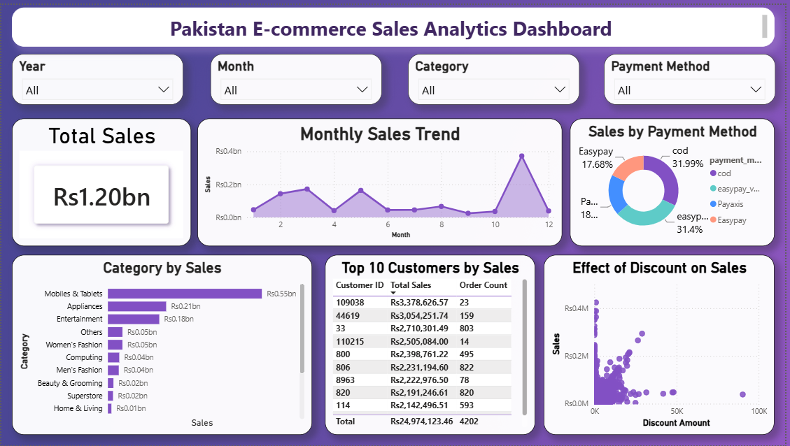

# Pakistan E-Commerce Data Analysis & Power BI Dashboard

End-to-end data analysis of Pakistan's largest e-commerce dataset, covering data preprocessing, exploratory data analysis (EDA), SQL analysis, KPI development, and interactive Power BI visualization.

## 📊 Project Overview

This project analyzes a large e-commerce dataset from Pakistan to uncover meaningful patterns, trends, and business insights.

The project follows an end-to-end data analysis workflow:

**Data Preprocessing → EDA → SQL Analysis → KPI Development → Power BI Dashboard**

## 📁 Dataset

The dataset used in this project is:

**Pakistan's Largest E-Commerce Dataset**

Source: [Kaggle](https://www.kaggle.com/datasets/zusmani/pakistans-largest-ecommerce-dataset)

The dataset contains e-commerce transaction data from Pakistan and is used for exploratory analysis, SQL-based analysis, and business intelligence visualization.

> The original dataset is not included in this repository due to its size. Please download it directly from Kaggle using the link above.

## 🔧 Technologies & Tools

- **Python**
- **Pandas**
- **NumPy**
- **Matplotlib**
- **Seaborn**
- **SQL**
- **Power BI**
- **Jupyter Notebook**

## 🧹 Data Preprocessing

The dataset was prepared for analysis through several preprocessing steps, including:

- Data cleaning
- Handling missing values
- Handling duplicate records
- Data type conversion
- Feature engineering
- Preparing the cleaned dataset for further analysis

## 📈 Exploratory Data Analysis

Exploratory Data Analysis was performed to understand the dataset and identify:

- Distribution of important variables
- Sales and transaction trends
- Customer and order patterns
- Relationships between variables
- Outliers and data quality issues
- Key business insights

Several visualizations were created using Python libraries such as Matplotlib and Seaborn.

## 🗄️ SQL Analysis

The cleaned dataset was analyzed using SQL to:

- Filter and aggregate transaction data
- Calculate business metrics
- Analyze sales trends
- Identify key patterns
- Generate KPIs for the dashboard

The SQL queries used in the analysis are available in:

`sql/pakistan_ecommerce_analysis.sql`

## 📊 Power BI Dashboard

The final cleaned dataset was imported into Power BI to build an interactive dashboard presenting key KPIs, trends, and business insights.

The Power BI project file is available at:

`powerbi/pakistan_ecommerce_dashboard.pbix`

### Dashboard Preview



## 📌 Key Outcomes

The project demonstrates an end-to-end workflow for transforming raw e-commerce data into actionable insights using:

**Python → SQL → Power BI**

It combines data preprocessing, exploratory analysis, SQL querying, KPI development, and business intelligence visualization in a single project.

## 📂 Repository Structure

```text
pakistan-ecommerce-data-analysis/
│
├── README.md
├── requirements.txt
├── .gitignore
│
├── notebooks/
│   └── pakistan_ecommerce_analysis.ipynb
│
├── sql/
│   └── pakistan_ecommerce_analysis.sql
│
├── powerbi/
│   └── pakistan_ecommerce_dashboard.pbix
│
└── images/
    └── powerbi_dashboard.png

👤 Author

John Medhat

LinkedIn: John Medhat
GitHub: JohnMedhat
